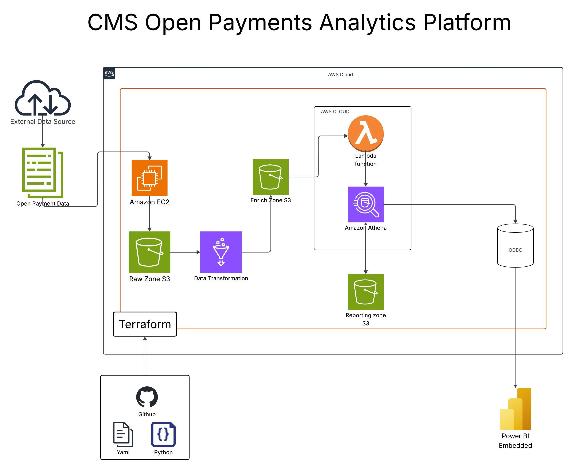
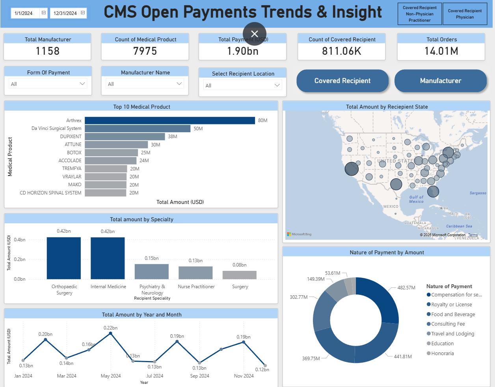

💊 Open Payments Data Analysis & BI Dashboard Framework
---
📌 Overview
--
This project focuses on the analysis and visualization of CMS Open Payments data to understand financial relationships between physicians, teaching hospitals, and life sciences manufacturers.

Using Big Data technologies, the project processes large-scale payment records to uncover temporal trends, geographic concentration, payment drivers, and competitive manufacturer behavior.

By leveraging distributed data processing frameworks and modern BI tools, the project delivers actionable insights into physician influence, payment composition, and manufacturer benchmarking through interactive dashboards designed for multiple business audiences.

---
🎯 Key Objectives
---
Collect and process large-scale CMS Open Payments data using Big Data tools

Clean, standardize, and transform high-volume payment records

Analyze payment trends across time and geography

Explain why physician payments are high by breaking down payment types and categories

Benchmark manufacturers against competitors based on spending and reach

Identify dominant therapeutic areas and product categories

Visualize insights through interactive, audience-specific BI dashboards

Demonstrate the application of Big Data analytics in healthcare transparency and market intelligence

---
📂 Dataset Information
Source
---
Source: https://openpaymentsdata.cms.gov/dataset/e6b17c6a-2534-4207-a4a1-6746a14911ff
CMS Open Payments Program
(Centers for Medicare & Medicaid Services)

Description
The dataset contains detailed records of financial transactions between healthcare manufacturers and physicians, including:
General Payments
Research Payments
Ownership & Investment Interests
These records enable deep analysis of payment behavior, influence patterns, and manufacturer strategies.

### 🧹 Columns After Clean and Transform :

| Column Name | Description |
|-------------|-------------|
| covered_recipient_type | The type of covered recipient (physician, Non-physician) |
| teaching_hospital_name | Name of the teaching hospital (if applicable) |
| recipient_city | City where the recipient is located |
| recipient_country | Country where the recipient is located |
| recipient_category | Category of recipient (physician, non-physician, etc.) |
| manufacturer_payment_id | Unique identifier for the payment |
| manufacturer_payment_name | Name associated with the payment |
| manufacturer_payment_country | Country of the manufacturer making the payment |
| total_amount_of_payment_usdollars | Total payment amount in USD |
| date_of_payment | Date on which payment was made |
| number_of_payments_included_in_total_amount | Count of individual payments included |
| form_of_payment | Type of payment format (cash, check, etc ) |
| nature_of_payment | Nature of the payment (e.g., consulting fee, travel) |
| record_id | Unique ID for the data record |
| covered_or_noncovered_indicator | Indicator if the payment is covered or not |
| medical_product_type | Type of medical product associated with payment |
| product_category | Category of associated products |
| medical_product_name | Name of the specific medical product |
| program_year | Reporting year of the payment |
| covered_recipient_full_name | Full name of the recipient |
| recipient_unique_id | Unique identifier for the recipient |
| recipient_state_final | State of recipient after final normalization |
| specialty_main | Main specialty of the physician recipient |
| manufacturer_name_base | Base name of the manufacturer |
| manufacturer_payment_state | State of manufacturer payment origin |

---

## 📂 Raw Data Overview

| Attribute        | Details     |
|------------------|-------------|
| Files            | 1 CSV File  |
| Total Size       | ~8 GB       |
| Time Period      | 2023 – 2024 |
| Total Rows       | 1.5 CR+     |
| Total Columns    | 91          |

---

## 🛠️ Project Tech Stack

| Category                          | Tools / Frameworks                                  |
|----------------------------------|----------------------------------------------------|
| AWS Cloud Service                | AWS S3, AWS Glue, AWS Athena, AWS EC2, AWS Lambda |
| Programming Language             | PySpark, SQL                                       |
| Automation & CI/CD               | Terraform, GitHub Actions                          |
| Project Management & Collaboration | Jira, GitHub                                      |
| Visualization Tool               | Power BI                                           |

## 🏗️ Architecture Diagram

## 📈 Dashboard

